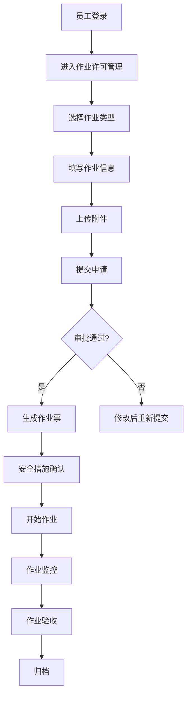
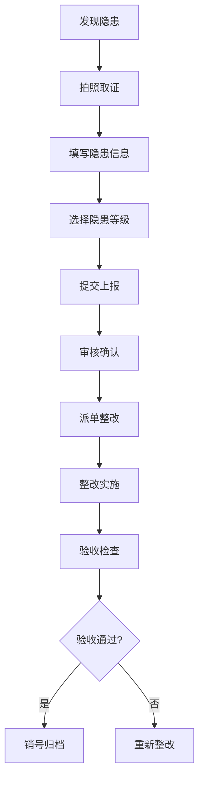
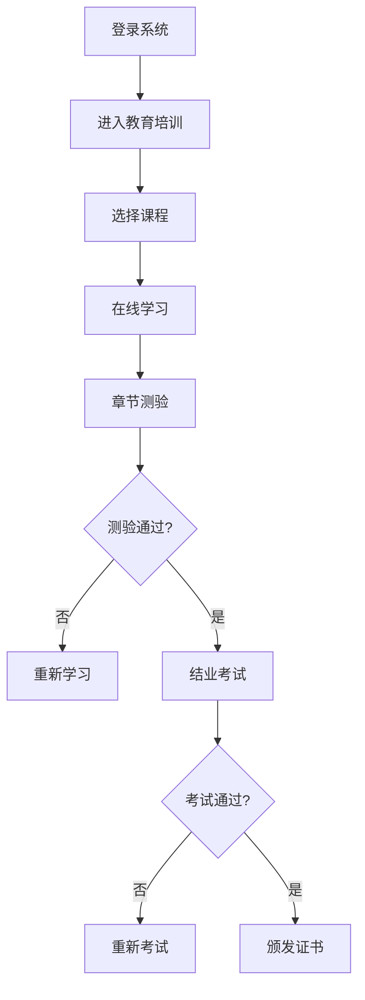

# EHS安全管理平台 - 使用说明

---

## 📋 目录

1. [系统概述](#系统概述)
2. [登录与权限](#登录与权限)
3. [功能模块详解](#功能模块详解)
   - [仪表盘](#仪表盘)
   - [作业许可管理](#作业许可管理)
   - [教育培训](#教育培训)
   - [双重预防机制](#双重预防机制)
   - [综合管理](#综合管理)
4. [顶部导航功能](#顶部导航功能)
5. [移动端使用](#移动端使用)
6. [常见问题](#常见问题)
7. [操作流程图](#操作流程图)

---

## 1. 系统概述

### 1.1 系统简介

**EHS安全管理平台**是一套专为化工企业设计的安全生产管理系统，涵盖**隐患排查、作业票管理、培训教育、应急管理、实时预警**等核心业务模块。

### 1.2 适用对象

| 用户角色 | 功能权限 |
|---------|---------|
| **系统管理员** | 完整权限，可配置系统参数、管理用户和角色 |
| **安全管理人员** | 隐患管理、作业票审批、培训管理、报表查看 |
| **部门负责人** | 审批本部门作业票、查看部门安全统计 |
| **一线员工** | 隐患上报、作业票申请、在线学习、考试 |

### 1.3 技术架构

```
┌─────────────────────────────────────────────────────────────┐
│                      用户访问层                            │
│  [PC浏览器]          [H5移动端]          [IoT设备]          │
└─────────────────────────────────────────────────────────────┘
                              │
                              ▼
┌─────────────────────────────────────────────────────────────┐
│                      Nginx 反向代理                        │
│  /        → PC前端      /h5/     → H5前端     /api/ → 后端 │
└─────────────────────────────────────────────────────────────┘
                              │
                              ▼
┌─────────────────────────────────────────────────────────────┐
│                     Node.js 后端服务                       │
│  Express + TypeScript + JWT + PM2                          │
└─────────────────────────────────────────────────────────────┘
                              │
                              ▼
┌─────────────────────────────────────────────────────────────┐
│                    MySQL 8.0 数据库                        │
└─────────────────────────────────────────────────────────────┘
```

---

## 2. 登录与权限

### 2.1 登录流程

1. **访问地址**：http://服务器IP地址（PC端）或 http://服务器IP地址/h5/（移动端）

2. **登录页面**：
   - 输入用户名和密码
   - 填写图形验证码
   - 点击「登录」按钮

3. **默认账号**：
   - 用户名：`admin`
   - 密码：`admin123`

### 2.2 权限说明

系统采用 **RBAC（基于角色的访问控制）** 模型：

| 权限类型 | 说明 |
|---------|------|
| **菜单权限** | 控制用户可访问的菜单项 |
| **操作权限** | 控制用户可执行的操作（新增、编辑、删除、审批等） |
| **数据权限** | 控制用户可查看的数据范围（部门、岗位等） |

### 2.3 退出登录

点击右上角用户头像 → 选择「退出登录」

---

## 3. 功能模块详解

### 3.1 仪表盘

**功能定位**：首页概览，展示关键安全指标

**主要内容**：

| 模块 | 说明 |
|-----|------|
| **安全指数** | 综合安全评分（0-100分） |
| **隐患统计** | 本月隐患数量、整改率、逾期率 |
| **作业票统计** | 本月作业票数量、类型分布 |
| **培训统计** | 培训完成率、证书到期预警 |
| **实时预警** | 隐患逾期、证书到期、设备维护提醒 |
| **快捷入口** | 快速创建作业票、上报隐患、发起培训 |

### 3.2 作业许可管理

**功能定位**：化工企业核心安全管理模块，规范特殊作业流程

**支持的作业类型**：

| 作业类型 | 说明 | 审批流程 |
|---------|------|---------|
| **动火作业** | 焊接、切割、喷灯等热工作业 | 班组→车间→安全科 |
| **受限空间** | 进入密闭或半密闭空间作业 | 班组→车间→安全科→分管领导 |
| **高处作业** | 坠落高度≥2米的作业 | 班组→车间→安全科 |
| **电气作业** | 电气设备检修、接线等 | 班组→电工班→安全科 |
| **吊装作业** | 起重吊装作业 | 班组→设备科→安全科 |

**作业票流程**：

```
申请 → 风险评估 → 安全措施确认 → 审批 → 作业中监控 → 验收 → 归档
```

**关键功能**：

1. **作业票申请**
   - 填写作业基本信息
   - 选择作业类型和级别
   - 上传作业方案和风险评估报告

2. **安全措施确认**
   - LOTO挂牌上锁（电气作业）
   - 气体检测记录
   - 安全交底签字

3. **审批流程**
   - 多级审批（班组→车间→安全科）
   - 审批意见记录
   - 驳回修改功能

4. **作业监控**
   - 作业时长计时
   - 延期申请
   - 实时气体监测（对接IoT设备）

5. **作业验收**
   - 现场验收记录
   - 签字确认
   - 归档保存

### 3.3 教育培训

**功能定位**：员工安全培训与资质管理

**主要模块**：

| 模块 | 说明 |
|-----|------|
| **在线课程** | 安全法规、操作规程、事故案例等 |
| **考试中心** | 在线考试、自动评分、成绩查询 |
| **证书管理** | 特种作业证、培训证书、到期提醒 |
| **TNA培训矩阵** | 岗位培训需求分析、培训计划制定 |

**学习流程**：

```
选课 → 在线学习 → 章节测验 → 结业考试 → 证书颁发
```

**证书管理**：
- 证书有效期管理
- 到期自动提醒（提前30天）
- 证书复审流程

### 3.4 双重预防机制

**功能定位**：风险分级管控与隐患排查治理

**主要模块**：

| 模块 | 说明 |
|-----|------|
| **风险分级管控** | 风险点识别、分级、管控措施制定 |
| **隐患排查治理** | 隐患上报、整改、验收闭环管理 |
| **统计分析** | 风险分布图、隐患趋势分析 |

**风险分级标准**：

| 级别 | 颜色标识 | 管控要求 |
|-----|---------|---------|
| **重大风险** | 红色 | 公司级管控，专项方案 |
| **较大风险** | 橙色 | 车间级管控，专项措施 |
| **一般风险** | 黄色 | 班组级管控，常规措施 |
| **低风险** | 蓝色 | 岗位级管控，日常检查 |

**隐患排查流程**：

```
发现隐患 → 上报登记 → 派单整改 → 整改实施 → 验收销号
```

### 3.5 综合管理

**功能定位**：设备、文档、应急等综合安全管理

**主要模块**：

| 模块 | 说明 |
|-----|------|
| **设备管理** | 设备台账、维护计划、故障记录 |
| **文档管理** | 安全规章制度、操作规程、应急预案 |
| **应急管理** | 应急预案、应急物资、演练记录 |

**设备管理**：
- 设备档案管理
- 维护保养计划
- 设备状态监控
- 故障报修流程

**应急管理**：
- 应急预案库
- 应急物资储备
- 演练计划与记录
- 事故报告管理

---

## 4. 顶部导航功能

### 4.1 待办提醒

点击顶部「待办提醒」图标，显示待处理事项：

| 类别 | 说明 |
|-----|------|
| **作业票待审批** | 需要您审批的作业票列表 |
| **隐患待整改** | 分配给您的隐患整改任务 |
| **证书即将到期** | 即将到期的培训证书提醒 |

### 4.2 全局搜索

点击搜索图标，可搜索：
- 作业票编号
- 隐患编号
- 员工姓名
- 设备名称
- 文档标题

### 4.3 用户菜单

点击用户头像，显示菜单：
- **个人信息**：查看/修改个人资料
- **修改密码**：安全修改登录密码
- **退出登录**：安全退出系统

---

## 5. 移动端使用

### 5.1 访问方式

- **直接访问**：打开手机浏览器，输入 http://服务器IP地址/h5/
- **添加到桌面**：在浏览器中选择「添加到主屏幕」

### 5.2 移动端功能

| 功能 | 说明 |
|-----|------|
| **隐患上报** | 现场拍照上报隐患，支持定位 |
| **作业票申请** | 移动端发起作业票申请 |
| **在线学习** | 碎片化学习安全知识 |
| **考试答题** | 移动端参加安全考试 |
| **消息提醒** | 接收审批、整改等通知 |

### 5.3 离线巡检

支持离线状态下进行巡检记录，联网后自动同步数据。

---

## 6. 常见问题

### 6.1 登录问题

**Q：忘记密码怎么办？**

A：联系系统管理员重置密码，管理员路径：系统管理 → 用户管理 → 重置密码

**Q：登录提示验证码错误？**

A：点击验证码图片刷新，确保输入的验证码与图片一致（区分大小写）

### 6.2 作业票问题

**Q：作业票如何延期？**

A：在作业票详情页点击「申请延期」，填写延期理由，等待审批

**Q：如何关联气体检测记录？**

A：在作业票申请时，可手动录入气体检测数据，或自动关联IoT设备上报数据

### 6.3 培训问题

**Q：课程无法播放？**

A：检查网络连接，确保浏览器支持HTML5视频播放

**Q：证书到期了怎么办？**

A：系统会提前30天提醒，联系培训管理员安排复审培训

### 6.4 系统问题

**Q：页面加载缓慢？**

A：检查网络连接，清理浏览器缓存，或联系管理员检查服务器状态

**Q：操作提示权限不足？**

A：联系管理员检查角色权限配置

---

## 7. 操作流程图

### 7.1 作业票申请流程



### 7.2 隐患排查流程



### 7.3 培训学习流程



---

## 📞 技术支持

| 联系方式 | 说明 |
|---------|------|
| **系统管理员** | 负责用户管理、权限配置、系统维护 |
| **安全管理员** | 负责作业票审批、隐患管理、培训安排 |
| **技术支持** | 负责系统故障排查、功能优化 |

---

**文档版本**：v1.0  
**更新日期**：2026年5月  
**适用系统**：EHS安全管理平台

---

> **⚠️ 安全提示**：请妥善保管您的账号密码，定期修改密码。离开电脑时请及时退出系统。